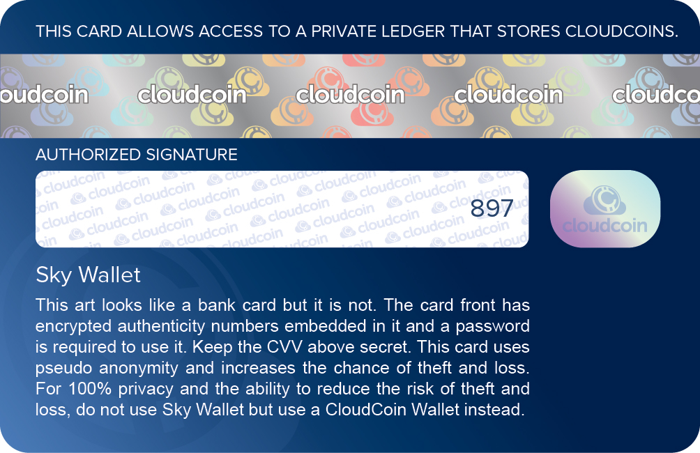

## CLOUDCOIN CARD STANDARD
This is the standard for creating a CloudCoin "Credit Card" that contains a serial number and ANs of
a CloudCoin that looks like the familiar Credit Card and can be used to access a Skywallet account. 

Example CARD:
```
Sean.CloudCoin.Global
9011 5985 4567 8522
EXP 09/22
CVV 5485
```

### GENERATING THE CARD BASED ON A SKYWALLET ID

* The SN comes from a resolving the SkyWallet name to IP then to decimal. 

* First number must be '9'. Nine means CloudCoin

* The Next two digits are the NN (Network Number) and now it will be 01. 

* The next 12 digits are the first part of the PAN-Generator called 'R' for Random. 

* The last digit is the mod10 Check sum. Add up all the previous numbers. Then figure out what number is necessary for the number to be divisible by 10. Luhn Algorithm

* Exp Month 01-12 ( 2 digit month - one month before the real exp month).

* Exp Year ( 2 digit year of coin expiration).

* CVV (A 4 digit number ). Part of the PAN-Generator coded as 'C'. 

### PAN-Generator 
The PAN-Generator parts are 12 digit random number and a the 4 digit CVV. R(andom) and C(VV). 
Here is an example with 452459836515 being random and 8925 being the CVV:
```
Pattern: RRRRRRRRRRRRCCCC

PAN-Generator: 4524598365158925
```
### Generating PANs from the PAN-Generator
Add the RAIDA number in front of the PAN-Generator and run an MD5 Hash:
```
PAN for RAIDA 0: 04524598365158925 MD5 Hash c5eea8d38295aa8a60e766091e55b816
PAN for RAIDA 1: 14524598365158925 MD5 Hash e385cc046dd21eb1c05c00fea43ffea4
PAN for RAIDA2 through RAIDA22 left out for brevity..
PAN for RAIDA23 234524598365158925 MD5 Hash 424563309BF5D153C2209412BBC95DF8
PAN for RAIDA24 244524598365158925 MD5 Hash  8C55ABEAFEDA28A9F875BE816C7BE1EB
```
Now you have the PANs. These PANs must be put in the RAIDA by calling a detect service and using the original ANs. 

## Saving the coins to file:
The Coins can then be saved in a CSV credit Card file. The fields are the PAN-G, Exp. Date, CVV, SN and the QR. (all of them put together in one string that can be used to create a QR code).
"Credit Cards 12 11 2019 04 04 12.csv"
```
4524598365158925,02/25,8925,16777200,45245983651589250225892516777200
8563189457264505,02/25,0505,16777201,85631894572605050225050516777201
6521695249265289,02/25,1289,16777202,65216952492512890225128916777202
```

# CREDIT CREATION CARD PROTOCOL
Here is anotherway that Credit Cards can be created dynamically with the help of the user who uses their own CloudCoin. 

This gives a person a "Skywallet" credit card that they can use as a key to manipulate money on the Sky Wallet. They can also use it as an ID for other applications. The Sky Wallet ID is embedded in a PNG image and can also be entered manually from the numbers on the card.

How to make a Sky Wallet Card. 
Ask them for their email address.

Put the email address in the Database. Make sure it is not a duplicate. 

Have them verify it. When they do direct them to the MakeID.php page:
 

1. This may be provided by the user or the JSON may go out and get a stack file from a server that is provided for free.  

2. Ask the user for a Skywallet ID. Must follow the rules of a DNS name. If they are advanced users, they can choose a name that they will register with their own DNS server. If they are not advanced users, they can register with the Skywallet DNS server for free. Check that the name is not taken by doing a DNS request to that name. If it is not taken, use the DDNS.php to register the Skywallet name. You will first need to read the coin's SN and convert it into an IP address.  
Example Skywallet ID: Jerry.Skywallet.cc


3. Ask the user to provide a PIN that can be entered into a payment terminal. The PINs must be at least 4 numbers long. This PIN must not be forgotten. If they are forgotten the all the coins in the account will be lost for at least 5 years. so the PIN should be written down and kept somewhere safe. If the user dies, their heir must have these numbers to collect the CloudCoins. 
 ```
Example PIN: 5377
```

4. The PIN is the CCV
```
Example CCV: 5377
```
5. Generate a random twelve number card number:
```
Example: 564485945250
```
6. Add up all the numbers in the card number:
```
5+6+4+4+8+5+9+4+5+2+5+0=57  
```
7. Find the parity. Find out how much you must add to make the number dividable by 10. If the number is 57, then we would need to add 3 to make 60. If the number was 43, then we would need to add 7 to make the number 50. This will be a number between 0 and 9 inclusive. 
```
Example: 3
```
8. Put all the numbers together with the most random ones first to create the Master Seed. 
```
Card Numbers, Parity Number, CCV, PIN
 Example: 564485945250,3,5377
Combined: 56448594525035377
```
9. Use the number to create a see for each of the 25 RAIDA's AN. Do this by adding the RAIDA number to the front of the combined. 
```
Seed for RAIDA 0: 05644859452538515377
Seed for RAIDA 1: 15644859452538515377
Seed for RAIDA 2: 25644859452538515377
Seed for RAIDA 3: 35644859452538515377
----------------------4 though 22 left out
Seed for RAIDA 23: 235644859452538515377
Seed for RAIDA 24: 245644859452538515377
```
10. Generate ANs by running each of the sees through an MD5 Hash. 
```
AN for RAIDA 0 using seed 056448594525385180125456: 0f0bbc82ce84d80d1345525961ef32f7
AN for RAIDA 1 using seed 156448594525385180125456: 40dc9bc4fe9904fcf3bebd9aab62ff1b
etc. 
```
11. Now pown the coins with the new ANs. 

12. OPTIONAL: Use the Password to encrypt the ANs. 
This is for future use if it proves to be neccessary. 
Use the Vaulter spec here: https://cloudcoinconsortium.org/software.html
(You will need to write some extra aoid info in the jpeg)

14. Download the template of the front of the card and back of the card. From here.





15. Use HTML5 Canvas to write text on the file use the fonts:

See this: http://jsfiddle.net/zMKge/

See the otf fonds in this repo.

See this: http://jsfiddle.net/zMKge/

Sample of what it should look like when done: 


NOTE: There will be two jpg images, not one. 

16. Write the coin to the JPG credit card template using this spec:

https://github.com/CloudCoinConsortium/CloudCoin/tree/master/CloudCoin%20File%20Formats/jpg

You will need to add 9001 to the random 11 digit card number and the parity number like this from the example above:
```
9001 5644 8594 5253
Add an expiration date that is five years from last month. 
Add the name of the user's Skywallet account like "John.Skywallet.cc"
```
17.

Give the JPGs of the Front and Back to the user on the web page. With instruction on how to right click them to download. 
 


