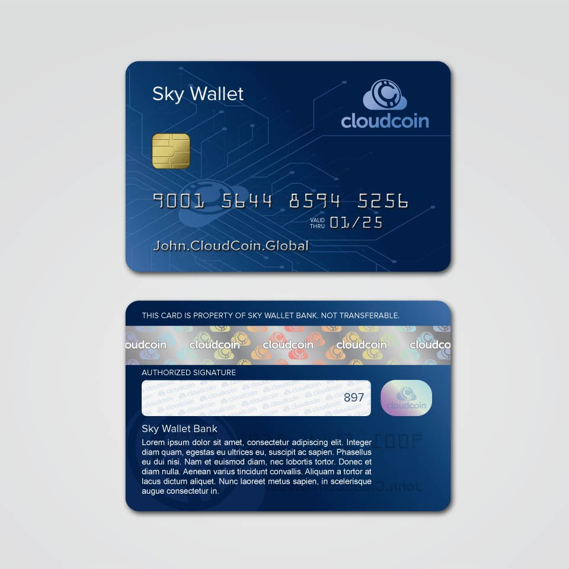

## CLOUDCOIN CARD STANDARD
This is the standard for creating a CloudCoin "Credit Card" that contains a serial number and ANs of
a CloudCoin that looks like the familiar Credit Card and can be used to access a Skywallet account. 

Example CARD:
```
Sean.CloudCoin.Global
9011 5985 4567 8522
EXP 09/22

Back of Card:
CVV 5485

```

### GENERATING THE CARD BASED ON A SKYWALLET ID

* The SN comes from a resolving the SkyWallet name to IP then to decimal. 

* First number must be '9'. Nine means CloudCoin

* The Next two digits are the NN (Network Number) and now it will be 01. 

* The next 12 digits are the first part of the PAN-Generator called 'R' for Random. 

* The last digit is the mod10 Check sum. Add up all the 15 numbers in the card number and the CVV. Then figure out what number is necessary for the number to be divisible by 10. Luhn Algorithm. Since we include the cvv, it is not a true Luhn Algorith:
Sample Card Number: 9010 0307 2080 301*  CVV 5131
Add the numbers up and it equals 44. Devide by 10 any you get 6 remainer. You must add 6 to make it divisable by 10. So you make the last number of the card =6. The card number becomes: 9010 0307 2080 3016 CVV 5101

* Exp Month 01-12 ( 2 digit month - one month before the real exp month).

* Exp Year ( 2 digit year of coin expiration).

* CVV (Must be at least 4 digit in length ). Part of the PAN-Generator coded as 'C'. 

### PAN-Generator 
The PAN-Generator parts are "9" for the CloudCoin sysem, N(two digit network number), 12 digit random number, Luhn number, and a the 4 digit CVV. 9, N(Nework Number, R(andom), L(Luhn Number) and C(VV). 
Here is an example with 452459836515 being random and 8925 being the CVV:
```
Pattern: 9NNR RRRR RRRR RRRL CCCC (Spaces have been added for easy reading).

Random number: 452459836515 

Pin/ccv: 8925

Luhn:

9+0+1+4+5+2+4+5+9+8+3+6+5+1+5+8+9+2+5=86 We must add 4 to make the card number and pin number divisable by 10. So the Luhn number is 
4. 
PAN-Generator: 9014 5245 9836 5154 8925
```
### Generating PANs from the PAN-Generator
Add the RAIDA number and the SN in front of the PAN-Generator and run an MD5 Hash:
NOTE: Here the SN is 16,777,216.
```
PAN for RAIDA 0: 01677721690145245983651548925 MD5 Hash c5eea8d38295aa8a60e766091e55b816
PAN for RAIDA 1: 11677721690145245983651548925 MD5 Hash e385cc046dd21eb1c05c00fea43ffea4
PAN for RAIDA2 through RAIDA22 left out for brevity..
PAN for RAIDA23 231677721690145245983651548925 MD5 Hash 424563309BF5D153C2209412BBC95DF8
PAN for RAIDA24 241677721690145245983651548925 MD5 Hash  8C55ABEAFEDA28A9F875BE816C7BE1EB
```
Now you have the PANs. These PANs must be put in the RAIDA by calling a detect service and using the original ANs. 

## Saving the coins to file:
The Coins can then be saved in a CSV credit Card file. The fields are the PAN-G, Exp. Date, CVV, NN, SN and the QR. (all of them put together in one string that can be used to create a URL for a QR code).
"Credit Cards 12 11 2019 04 04 12.csv"
```
9014 5245 9836 5154, 02-25, 8925, 1, 16777200, n=1&s=16777200&r=9014524598365154&d=02-25&c=8925& 
9014 8563 1894 5726, 02-25, 0505, 1, 16777201, n=1&s=16777201&r=90148563189457266&d=02-25&c=0505& 
9016 5216 9524 9265, 02-25, 1289, 1, 16777202, n=1&s=16777202&r=9016521695249265&d=02-25&c=1289& 
```


15. Use HTML5 Canvas to write text on the file use the fonts:

See this: http://jsfiddle.net/zMKge/

See the otf fonds in this repo.

See this: http://jsfiddle.net/zMKge/

Sample of what it should look like when done: 



NOTE: There will be two jpg images, not one. 

16. Write the coin to the JPG credit card template using this spec:

https://github.com/CloudCoinConsortium/CloudCoin/tree/master/CloudCoin%20File%20Formats/jpg

You will need to add 9001 to the random 11 digit card number and the parity number like this from the example above:
```
9001 5644 8594 5253
Add an expiration date that is five years from last month. 
Add the name of the user's Skywallet account like "John.Skywallet.cc"
```
17.

Give the JPGs of the Front and Back to the user on the web page. With instruction on how to right click them to download. 
 


