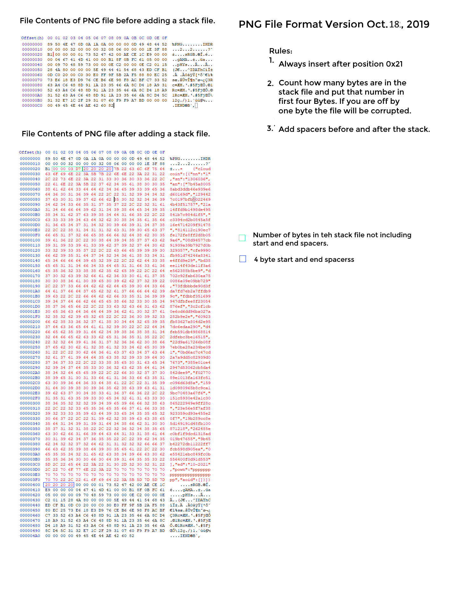

# PNG Format
PNG files can hold many CloudCoins. When put in a PNG that looks like a credit card, they can hold ID Keys that can be used to access SkyWallets. 

PNG files have "chuncks" that can be looked at seperatly by programs. We put a stack file in json format in the second chunk. 

