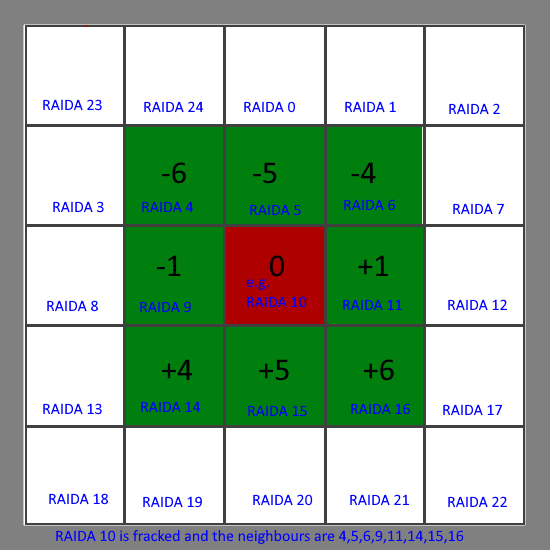

# RAIDA Protocol

Explains how to send messages to the Redundant Array of Independent Detection Agents and the responses that can be expected.
You will need to send messages to all 25 RAIDA in parallel. 

### Services:

[Echo](README.md#echo)

[Multi Detect](README.md#multi-detect)

[Hints](README.md#hints)

[Fix](README.md#fix)

[Fix Lost](README.md#fix-lost)

[Report Lost](README.md#report-lost) 

[Recover](README.md#recover) 

-----------------------------------------


# Echo 
### Purpose:
The purpose of the echo API is to allow a program (or user) to establish that a RAIDA is ready to detect the authenticity of CloudCoins and how many milliseconds the contact requires.

The client sends the RAIDA an Echo Request and the RAIDA will respond with a Echo Response.


Echo Request Example:
```
https://RAIDA0.CloudCoin.Global/service/echo
```
Note: Client uses HTTPS and GET method for the echo url located in the service folder on the RAIDA server.


Echo Response Example:
```
{
	"server": "RAIDA11",
	"status": "ready",
	"message": "Execution Time (ms) =0.137",
	"version": "2020-11-02",
	"time": "2020-11-13 01:37:28"
}
```
The execution time is the number of milliseconds that the RAIDA needed to complete a detection request of six loop back coins. This tells us how well the RAIDA is performing internally. 

--------------------------------------
# Multi Detect

The RAIDA Multi Detection Protocol allows many coins to be authenticated at the same time and returns tickets that can be used to fix fracked coins. See the fix service to
know how to use this ticket. 

Example **POST** authenticating three coins
```
https://RAIDA13.CloudCoin.Global/service/multi_detect
b=t&
nn=1&
sns[]=145895&sns[]=66585&sns[]=16589554&
ans[]=8ae06de0f9ce4917b3309df71570f92c&ans[]=b25fc7a548c341c98cefbac35689aff1&ans[]=f193f1304ffc4344822c10be9309a4c3&
pans[]=c7bea382188d404d8f0efc5969c54c5a&pans[]=75819e4721cb4970a2e2582d7e26318b&pans[]=0a4a8a4014264cbf8c00383ae180a152&
dn[]=1&dn[]=1&dn[]=250
```

Example Response if all tickets were successful:

```json
If all the coins were authentic:
            {
            	"server": "RAIDA11",
            	"status": "allpass",
            	"message": "All the coins were authentic",
		"ticket":"0a4a8a4010a4a8a4014264cbf8c00383ae180a152426",
            	"version": "2020-04-13",
            	"time": "2020-04-18 22:57:55"
            }
        
If all the coins were counterfeit:
            {
             	"server": "RAIDA11",
             	"status": "allfail",
             	"message": "All the coins were counterfeit",
             	"version": "2020-04-13",
             	"time": "2020-04-18 22:57:55"
             }
        
If some of the coins were counterfeit and some were authentic:
             {
             	"server": "RAIDA11",
             	"status": "mixed",
             	"message": "pass,pass,fail",
		"ticket":"0a4a8a4010a4a8a4014264cbf8c00383ae180a152426",
             	"version": "2020-04-13",
             	"time": "2020-04-18 22:57:55"
             }

```
If the status is not allpass, allfail or mixed, it means the call failed. Note that the ticket can be used for fixing fracked coins. 

Response if too many coins attached (over 4000)
```json
[
    {
        "server": "RAIDA0",
        "status": "dud",
        "message": "Parameters: Too many coins attached.",
        "version": "2019-05-02",
        "time": "2019-05-06 00:26:46"
    }
]
```
Response if input arrays are not the same length
```json
[
    {
        "server": "RAIDA0",
        "status": "dud",
        "message": "Parameters: Input arrays are not the same length.",
        "version": "2019-05-02",
        "time": "2019-05-06 00:29:11"
    }
]
```

----------------------------------------------

# Hints

Hints is used to confirm an identity of a person, process or program that owns a CloudCoin. It allows all systems to use the RAIDA as a single signin point.  


Example GET authenticating three coins
```
https://RAIDA0.CloudCoin.Global/service/hints?master_ticket=61fd09083302bb3eb8350dfeb1d7bf6c125b13e560bf

```
The master_ticket is the ticket that the client received from a detect response. 

Example Response if two of the three tickets are failed:
```html
16777214,16277215,16777216
```
The above response shows the results of one master ticket.
These are the serial numbers of the coins that match that master ticket. 

----------------------------------------------

# Fix

Fix allows you to fix many CloudCoins that are fracked at once. You will need to get master tickets from any five of the fracked coin's neighbours.   Suppose you get a coin and pown it. All RAIDA return "allpass" and a each one provides a master ticket. Except for RAIDA 18. RAIDA 18 returns "allfail".  Now you must fix RAIDA 18. You then find out which RAIDA are RAIDA18's trusted neighbours. You will need five that have tickets. 


Example Fix using five neighbours' master tickets
```
https://RAIDA0.CloudCoin.Global/service/fix?
       		regex=pp.p0.pp.&
		nn=1&
		pan=9f70f199f0844df2bd6e607620002cbf&
		a=a4aedc27bf524e3aabf8dbcca686140a8ae06de08934&
		b=11328c19f7ef4a63a4a56d25f9785c05197b44d4bae1&
		c=c35bfa217d364cc58d9c0a96a7a256f4822c10be9233&
		d=48df533f42364308b3a2ce15f1d216e266c649dc656a&
		e=48df533f42364308b3a2ce15f1d216e266c649dc656a&
		sn[]=145895&sn[]=66585&sn[]=16589554

```

The first thing you will need to do is calculate the regex parameter. The regex parameter tells the RAIDA which five of its neighbors you have collected tickets from. Each RAIDA has eight neighbours that it will accept tickets from. Here is a table of the neighbors that a RAIDA will accept tickets from: 

| -6 | -5 | -4 | -1 | 0  | +1 | +4 | +5 | +6 |
|----|----|----|----|----|----|----|----|----|
|    |    |    |    |    |    |    |    |    |

The zero represnts the ID of the RAIDA being fixed and the other numbers represent the relation of the trusted RAIDA to the fracked RAIDA. Suppose that RAIDA 12 is fracked. Then we will put RAIDA 12 in the zero poistion and we can calculate the trusted neighbors to be: 
| -6 | -5 | -4 | -1 | 0  | +1 | +4 | +5 | +6 |
|----|----|----|----|----|----|----|----|----|
|  6 |  7 |  8 | 13 | 12 | 14 | 16 | 17 | 18 |

Now we need to collect tickets from five neighbours. Suppose we get the tickets from RAIDA 6, 8, 13, 14 and 18. We put a 'p' (passed) on the neighbors that gave us ticketts, dots from neighbors that we did not get tickets from and a zero where the fracked RAIDA is like this:
| -6 | -5 | -4 | -1 | 0  | +1 | +4 | +5 | +6 |
|----|----|----|----|----|----|----|----|----|
| p  | .  | p  | p  | 0  | p  | .  | .  | p  |
| a  | .  | b  | c  | 0  | d  | .  | .  | e  |

Then we lay this out in serial it looks like this: 
```
regex=p.pp0p..p
```

Suppose we want to fix a fracked RAIDA 1. Our Neighbours look like this: 
| -6 | -5 | -4 | -1 | 0  | +1 | +4 | +5 | +6 |
|----|----|----|----|----|----|----|----|----|
| 20 | 21 | 22 | 0  | 1  |  2 |  5 |  6 |  7 |

Lets say we decided to pick our five neighors to be 22,0,2, 5 and 7.  

| -6 | -5 | -4 | -1 | 0  | +1 | +4 | +5 | +6 |
|----|----|----|----|----|----|----|----|----|
| .  | .  | p  | p  | 0  | p  | p  | .  | p  |
| .  | .  | a  | b  | 0  | c  | d  | .  | d  |

The regex parameter would then be:
```
..pp0.p.p
```


PARAMETERS:

pan: All serial numbers will be given the same pan. Update the AN in your coin. 

sn[]: Serial Numbers between 1 and 16,777,216 inclusive, to be fixed.

a,b,c,d,e: Tickets of neighbour RAIDA in order. 


RESPONSE: If all the coins were authentic
```

            {
            	"server": "RAIDA11",
            	"status": "allpass",
            	"message": "All the coins were authentic",
            	"version": "2020-04-13",
            	"time": "2020-04-18 22:57:55"
            }
        
If all the coins were counterfeit:
            {
             	"server": "RAIDA11",
             	"status": "allfail",
             	"message": "All the coins were counterfeit",
             	"version": "2020-04-13",
             	"time": "2020-04-18 22:57:55"
             }
        
If some of the coins were counterfeit and other authentic:
             {
             	"server": "RAIDA11",
             	"status": "mixed",
             	"message": "pass,pass,fail",
             	"version": "2020-04-13",
             	"time": "2020-04-18 22:57:55"
             }
 ```       
----------------------------------------------

# Fix Lost

The RAIDA Fix Lost Protocol allows many coins that are considered lost to be found.
A lost coin is created when a coin is detected but there is no response from the RAIDA. 
This means that it is uncertain if the AN or PAN is the Authenticity Number on the RAIDA.

The Fix Lost service allows the caller to send both AN and PAN to see if they are authentic.
The service then responds with the correct answer. If neither are correct, it will respond with 
a status of "Neither"

Example **POST** authenticating three coins
```
https://RAIDA0.CloudCoin.Global/service/fix_lost
  nn=1& 
  sns[]=1& 
  sns[]=3& 
  sns[]=7& 
  ans[]=9656ab1c988bc5347e5a5d331e3da401& 
  ans[]=1808b37cd2d72a0e2dd2675e3fb42b02& 
  ans[]=83492f468a0e4a21cb8b2aa2a94d640& 
  pans[]=9656ab1c988bc5347e5a5d331e3da401& 
  pans[]=1808b37cd2d72a0e2dd2675e3fb42b03& 
  pans[]=83492f468a0e4a21cb8b2aa2a94d6407& 
  denomination[]=1& 
  denomination[]=1& 
  denomination[]=1
```
Example response (the second coin failed, the third one has an error in AN):
```json
[
    {
        "server": "RAIDA0",
        "status": "an",
        "message": "9656ab1c988bc5347e5a5d331e3da401",
	"nn": "1",
        "sn": "3"
        "version": "2019-05-02",
        "time": "2019-05-06 00:19:27"
    },
    {
        "server": "RAIDA0",
        "status": "pan",
        "message": "1808b37cd2d72a0e2dd2675e3fb42b03",
	"nn": "1",
        "sn": "3"
        "version": "2019-05-02",
        "time": "2019-05-06 00:19:27",

    },
    {
        "server": "RAIDA0",
        "status": "neither",
        "message": "",
	"nn": "1",
        "sn": "3"
        "version": "2019-05-02",
        "time": "2019-05-06 00:30:16"
    }
]
```
Response if too many coins attached (over 4000)
```json
[
    {
        "server": "RAIDA0",
        "status": "dud",
        "message": "Parameters: Too many coins attached.",
        "version": "2019-05-02",
        "time": "2019-05-06 00:26:46"
    }
]
```
Response if input arrays are not the same length
```json
[
    {
        "server": "RAIDA0",
        "status": "dud",
        "message": "Parameters: Input arrays are not the same length.",
        "version": "2019-05-02",
        "time": "2019-05-06 00:29:11"
    }
]
```

# Report Lost
Tells the RAIDA that the person lost some CloudCoins. Will allow the user to recover them after five years. 

Exmple of a request: 
```
https://raida7.cloudcoin.global/service/report_lost?address=Sean@Worthington.net&lost_sn=555&lost_sn=556&date_lost=2019-12-30
```

# Recover
Allows people who embedded a hash of their email address into an AN to recover that coin. The ANs will be sent to the user's email.

Example of a call:
```
https://raida7.cloudcoin.global/service/recover_by_email
```
### PARAMETERS:
nn: Network Number. All coins must be on the same network.
sn: Payment Coin Serial Number between 1 and 16,777,216 inclusive
an: Payment coin Authenticity Number that is a guid without hypends. Lowercase prefered.
sns[] Array of lost coins.
email: The email whose hash has been enbedded in the last quarter of the AN.  

Example GET authenticating three coins
```
http://localhost/service/lost/recover_by_email?/service/recover_by_email?
	nn=1&
	sn=145895&
	an=8ae06de0f9ce4917b3309df71570f92c&
	sns[]=145895&sns[]=66585&sns[]=16589554&
	email=sean@worthington.net&
	raida=17
```        
RESPONSE:
```
If all the coins were authentic:
            {
				"server":"raida18",
				"status":"success",
				"message":"Payment coin was authentic. Your coins may or may not have been recovered. Check the email you specified.",
				"version":"2020-02-13",
				"time":"2020-05-10 05:27:09",
				"ex_time":0.012834787368774414
			}
	If all the payment coin was counterfeit:
            {
				"server":"raida18",
				"status":"fail",
				"message":"Payment Coin was counterfeit ",
				"version":"2020-02-13",
				"time":"2020-05-10 04:20:40",
				"ex_time":0.0022242069244384766
			}
        
	If all the coins were counterfeit:
             {
             	"server": "RAIDA11",
             	"status": "fail",
             	"message": "missing parameters",
             	"version": "2020-04-13",
             	"time": "2020-04-18 22:57:55"
             }
```
