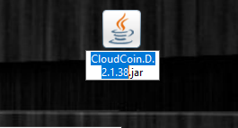
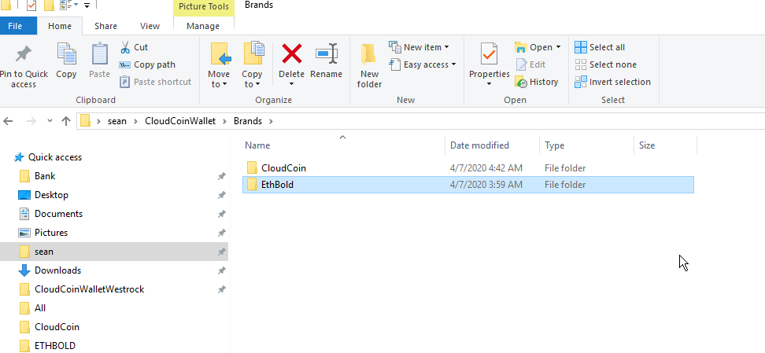
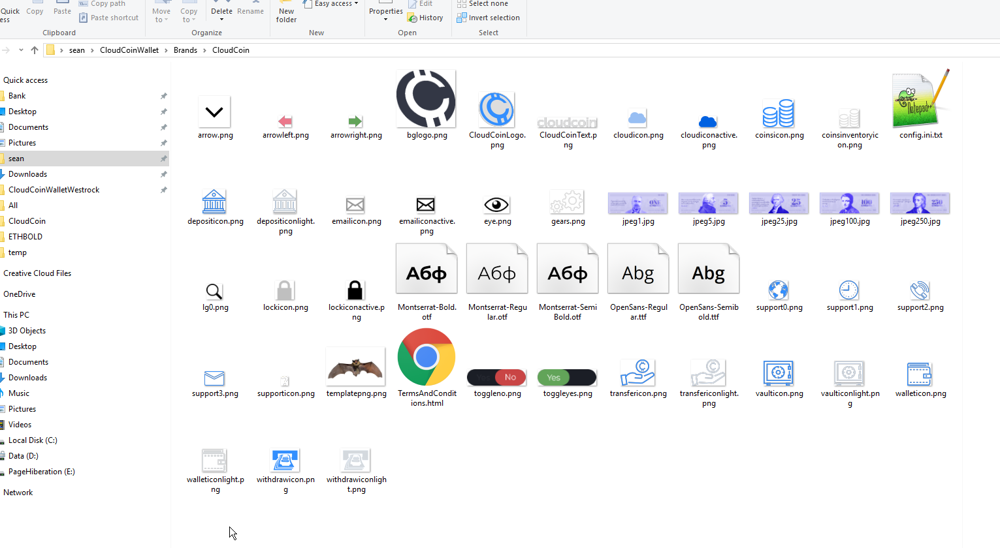
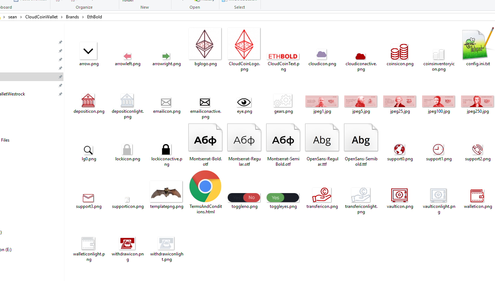

# Branding Instructions for the RAIDA Wallet

The RAIDA Wallet, also known as the CloudCoin Wallet, can be branded so that 
it works as any coin. In other words, the CloudCoin Wallet acts as a white lable coin and is completely brandable. 
You can create your own coin within a few hours and market it the next day. Your coins will be backed by the 
value of CloudCoin. 

## Tasks that you must perform to create your own coin and brand your wallet:

### Summary of tasks

1. Download the latest CloudCoin Wallet

2. Open the CloudCoin Wallet and create a wallet. 

3. Close the CloudCoin Wallet. 

4. Rename the CloudCoin Wallet jar file so that "CloudCoin" is replaced by your coin's name.

5. Go in the Brands subfolder and create a new folder with your coin's name. 

6. Copy everything from the CloudCoin folder in the brands folder to your coins' folder. Now you can edit all the contents there. 

7. Start the CloudCoin.D.2.1.38 Edit config.ini.txt

8. Change artwork in the assets folder

9. Upload your content to Wallet Server or distribute the file. 

# Detailed instructions

## 1. Download the CloudCoin Wallet
If you have not already done so, download the latest Dark version of the CloudCoin Wallet from  https://cloudcoinconsortium.com/use.html. The wallet must have a version higher than 2.1.38. This is an example of the file name: CloudCoin.D.2.1.38.jar. Place this file on your desktop or somewhere you will remember it. 

## 2. Open the CloudCoin Wallet and create a wallet. 
If you havn't already done so, open the newly downloaded wallet and let it download the default content. Agree to the terms and then create a wallet. Name the wallet what ever you like. 

## 3. Close the CloudCoin Wallet. 
Close the CloudCoin Wallet so you can rename the file and change the contents. 

## 4. Rename the CloudCoin Wallet jar file so that "CloudCoin" is replaced by your coin's name.

Suppose you have a coin named "CoolCoin", take your CloudCoin Wallet file and rename it so that the first part of the file name is CoolCoin. So if your CloudCoin Wallet is called: "CloudCoin.D.2.1.38.jar" then rename it CoolCoin.D.2.1.38.jar". Please use only lowercase characters and no spaces or special characters.  

## 5. Go in the Brands subfolder and create a new folder with your coin's name. 

On windows you can find the Brands folder at: 
```
C:\Users\yourusername\CloudCoinWallet\
```
Within the Brands folder, create a new folder that is the exact name the you renamed the progrm to. So if you coin is called "coolcoin" then you would create a folder within the Brands folder and call it "coolcoin".

## 6. Copy everything from the CloudCoin folder in the brands folder to your coins' folder. Now you can edit all the contents there. 

Simply copy all the files from the CloudCoin folder into your coin's folder. 

## 7. Edit config.ini.txt file
Here you can control all aspects of the your wallet. You can make changes and then see the changes when you open your Wallet. You can change the colors, and support information. 

## 8. Change artwork in the assets folder
You can replace or alter all the png files in the folder. You can add font files to give the text a custom look. You can edit the "terms and conditions.html" file so that meets your needs. You can change the jpeg templates so they look different. 



## 9. Upload your content to Wallet Server or distribute the file. 

Now  you are ready to distribute your wallet to your users. There are two ways to do this. One way is to send people the wallet.x.x.x.jar file and the CloudCoinWallet folder. This is more tricky for the user because they must put the CloudCoinWallet folder in the right place for it to work.  They must put this folder here: C:\Users\yourusername\CloudCoinWallet\

Another way is to pay 15,000 CloudCoins to have your content posted on RAIDATech's webserver so that it can be downloaded automaticaly the first time your user opens the file. RAIDATech may not agree to have your wallet on their server. Send you brand folder zipped up and 15,000 CloudCoins to CloudCoin@Protonmail.com to have your wallet info included. Then send you wallet to everyone and the brand will be downloaded based on the first word in the name of your wallet jar file. 


